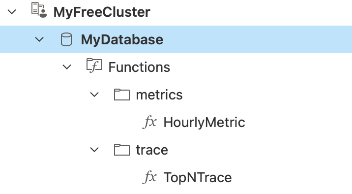
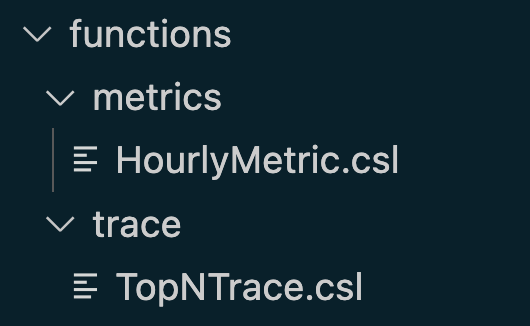
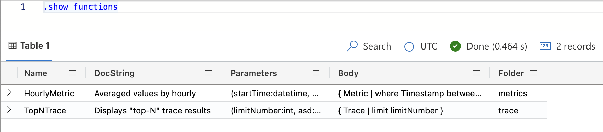

# Kusto Synced (`ksd`)

[](https://codecov.io/github/weikanglim/kusto-synced)

Kusto Synced (`ksd`) is a tool that simplifies and accelerates development for Kusto.
			
`ksd` enables you to:

- Store commonly used Kusto functions and tables in source control. Deploy the changes using a single command locally or on CI: `ksd sync`
- Share reusable functions across teams. Functions are organized in the cluster database using the filesystem directory structure, with first-class support for adding function documentation.
- Author source controlled functions with ease. Write functions and test them in Azure Data Explorer (or any of your favorite editors). Once you're happy, simply store it in a file. `ksd` automatically handles syncing these declarations to your Kusto database. (Learn more about this by running `ksd sync --help`)

## Walkthrough

### Step 1: Write your function

Write your function in your favorite Kusto editor, such as [Azure Data Explorer](https://dataexplorer.azure.com/) that provides intellisense, syntax validation, and allows testing against real data.

```kusto
// Returns service requests given a time window
let ServiceRequests = (start:datetime, end:datetime) {
    Requests
    | where TIMESTAMP between(start..end)
    | extend Method = tostring(customDimensions['http.method'])
    | extend Url = tostring(customDimensions['http.url'])
    | extend StatusCode = tostring(customDimensions['http.statusCode'])
    | project TIMESTAMP, Url, Method, StatusCode, DurationMs
}
```

To test your function, simply invoke the function:

```kusto
// Returns service requests given a time window
let ServiceRequests = (start:datetime, end:datetime) {
    Requests
    | where TIMESTAMP between(start..end)
    | extend Method = tostring(customDimensions['http.method'])
    | extend Url = tostring(customDimensions['http.url'])
    | extend StatusCode = tostring(customDimensions['http.statusCode'])
    | project TIMESTAMP, Url, Method, StatusCode, DurationMs
}
ServiceRequests(ago(1d), now())
```

Once you're happy, follow the next step.

## Step 2: Save it somewhere

You may choose to organize related functions in folders that make sense for you. A general recommendation is to store functions under a `functions` folder, and table definitions under a `tables` folder. This can be under `src`, or a different folder depending on your repository.

For this example, let's assume that you have the following setup, and saved your file as `ServiceRequest.csl` in `src/functions`.

```
- <REPO>
  - src
    - functions
      - ServiceRequest.csl
```

## Step 3: Sync your Kusto functions

If you have permissions to manage the target Kusto cluster and database, simply run `ksd sync` in your `functions` or `tables` folder.

```bash
cd src/functions
ksd sync --endpoint https://<my cluster>.kusto.windows.net/<my database>
```

Otherwise, add the following task to your CI pipeline (assuming linux):

GitHub Actions:

```yaml
- run: |
    wget https://github.com/weikanglim/kusto-synced/releases/latest/download/ksd_linux_x86_64.tar.gz
    tar -xzf ksd_linux_x86_64.tar.gz
    ./ksd sync src/functions
    ./ksd sync src/tables
```

Azure DevOps:

```yaml
- bash: |
    wget https://github.com/weikanglim/kusto-synced/releases/latest/download/ksd_linux_x86_64.tar.gz
    tar -xzf ksd_linux_x86_64.tar.gz
    ./ksd sync src/functions
    ./ksd sync src/tables
```

## Step 4: Examine new functions in the cluster

You should now be able to refresh your connection to the Azure Data Explorer, and see any new functions added:



Notice how the functions in the database is organized exactly how they are stored in source.



Also, notice that each function contains a docstring declaration that matches the comments you saved about your function.



It's that easy to write source-controlled functions and tables. 

## Benefits

1. Saving Kusto functions this way helps promotes sharing and creates reusable building blocks for you and your team (think documented libraries).
2. If your or your team uses a gated checkin process, you can also enforce higher quality, consistent, and well-maintained function.
3. Finally, when stored in source control, you are also able to retain revision tracking, search/refactor existing declarations when changed are made to your telemetry pipeline.

## Wanting to know more?

1. Check the examples directory for example of project layouts, and a starter GitHub CI pipeline.
2. Check the [FAQ](./docs/faq.md) for commonly asked questions.
3. If you have an unanswered question, search for existing issues on GitHub. If none exists, create an issue to start a discussion.
